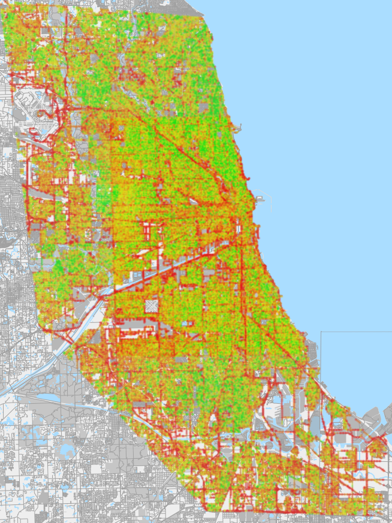

```{r setup, include=FALSE}
knitr::opts_chunk$set(
	echo = TRUE,
	fig.height = 7,
	fig.width = 10,
	message = FALSE,
	warning = FALSE,
	dev = "cairo_pdf",
	tidy = TRUE,
	tidy.opts = list(width.cutoff = 60)
)
library(tidyverse)
library(ggplot2)
library(here)
library(stringr)
library(knitr)
library(ggcorrplot)
library(ggmap)
library(sf)
library(Cairo)

source("../../theme.R")
windows.options(antialias = "cleartype")
options(device = Cairo::CairoWin)

knitr::opts_chunk$set(echo = TRUE,fig.width=10, fig.height=7, fig.pos = 'H', dev = "cairo_pdf", tidy.opts=list(width.cutoff=60), tidy=TRUE)

```

## Background

Effective policing has been a difficult goal to achieve throughout the world. The biases of those who make laws and those who enforce laws can lead to severe injustices for citizens. In theory, a democracy should help rectify injustices in law enforcement, as those who would be impacted unfairly by policies can vote against them. However, in reality, a wide range of inequalities can infiltrate democracy and cater to certain groups more than others.

However, an equally terrifying issue is where citizens' opinions are correctly represented by their democracy, but their thoughts and feelings on policies do not line up with the reality. While problems like corruption are difficult to tackle, shifting public opinion is an even trickier obstacle to overcome. Not only is public opinion difficult to change, but there is a moral question as well. There is a fine line between attempting to change people's opinions and propaganda.

These problems are most visible in many Latin American democracies, although it certainly is not exclusive to those regions. Aguero and Stark [-@aguero, pp. 264] "stress[ed] that democracy is as much a qualification of society as it is of politics". The whole of society needs to maintain a sufficient standard of education and morality for a democracy to work effectively. These researchers found that despite increased democratization in Brazil, fair policing had actually decreased [@aguero]. Revenge killings by the police still occurred,  which while fueling extreme responses in some citizens, others were less concerned [@aguero]. This was further exacerbated by the purview of transgressions by the military police shifting from civil courts to military courts [@aguero]. This made it difficult for citizens to hold Brazilian police accountable [@aguero].

This all, of course, assumes that citizens remain against police brutality, both privately and publicly, which is not a given. Oftentimes, citizens actually support an (overwhelmingly) strong police force, thinking it will be more effective against the crime that plagues their neighborhoods [@aguero]. As one Brazilian governor put it, "what the population wants is that the police act boldly" as "the more police in the streets, the more chances of confrontations between criminals and policemen" [@holston, pp. 272]. Even though the notion is incorrect, citizens often feel that there is a trade-off between effective crime fighting and retention of their civil liberties, leading to their support of increased police violence against their best interests [@ahnen]. This leaves many citizens choosing to worry about reducing crime first and solving civil rights issues later [@mendez].

Furthermore, others do not feel comfortable publicly speaking out about theses issues, either in fear of police retaliation, or simply due to a lack of belief that their voice will be heard [@aguero]. Many consider taking a stand against the police or justice into their own hands to be not worth the effort [@aguero]. Even though these injustices may affect their daily lives, it is difficult for people to take on these complex issues when many already struggle just to make a living.

Citizen's apathy for justice is vindicated by the additional hurdles of inequalities and inefficiencies in their democracy. No government, however well intentioned, is perfect, and inevitably, some will gain more political power than others. In many modern democracies, money talks, and citizens of upper classes can simply pay their way out of a criminal offense when they break the law [@aguero]. Those in lower classes who cannot pay a fine as a punishment are at risk of jail time if arrested, making the law more punitive to those with less money. Since upper class citizens are very rarely victims of police violence themselves, and if they are, have more avenues for restitution due to increased resources and political power, it is of no surprise that the upper class would remain unconcerned about police violence.

If those who have more money also have more political power, as is often the case, then the opinions of the upper class also carry more weight in creating public policy. Even if the majority of people do not support police violence, the upper class often see it as necessary to maintain order [@aguero]. This also maintains the social hierarchy that the upper class depends on. Democratization naturally gives more power to lower classes to choose populist candidates and polices [@ahnen]. Therefore the upper class uses their political power to support police violence, and therefore the oppression of lower classes, to restrict populist movements from taking hold [@ahnen].

Yet, these problems are not unique to democracies Latin America. People in The United States are struggling with their own democratic obstacles. Americans who felt an attack was more likely in their neighborhood were more likely to support increased police power [@block]. White Americans who feared the police were also more supportive of strong civil liberties [@block]. Many American municipalities depend on revenue from fines and tickets to function, reinforcing increased policing through financial means [@farrell]. Racial minorities in America are stereotyped as being more aggressive and more likely to commit crimes, leading to racial profiling and giving justification for police officers to commit acts of violence [@najdowski].

## About the Project
As established previously, there often exists a discrepancy between the perceptions and realities of safety and crime, which can lead to support of increased use of force by law enforcement, even when it is against the community's best interests. Chicago is a highly segregated city, which has contributed to a city culture built around racial stereotypes. Unsurprisingly, "safe" areas are generally considered to be the North Side, which is primarily inhabited by whites, while the South and West Sides, where primarily racial minorities live, are considered unsafe. This project aims to investigate these cultural claims about safety using crime data for Chicago and data from MIT's Streetscore project. 


## About the Data
```{r import-data, echo=FALSE, message=FALSE, warning=FALSE, cache=TRUE}
chi_crime_data = readRDS(here("Data", "chi_crime_data_cleaned.rds"))
chi_crime_data$Beat = chi_crime_data$Beat %>% as.numeric()
chi_crime_data$District = chi_crime_data$District %>% as.numeric()
chi_crime_data = chi_crime_data %>% bind_cols(as_tibble(st_coordinates(chi_crime_data)))

data_sample = chi_crime_data %>% head(5) 
data_sample$Date = as.character(data_sample$Date)
#data_sample %>% kable(format = "markdown")

num_obs= chi_crime_data$ID %>% length()
num_vars = chi_crime_data[1,] %>% unlist() %>% length()
```
Crime data was obtained through the City of Chicago's Open Data Portal on April 26, 2019. While the original data stretches from 2001 to approximately current day, the data was subsetted to `r num_obs` observations from January 1, 2014 to December 31, 2018. Each observation in the dataset is a crime reported to and/or responded to by the Chicago Police Department, with each variable containing information about the aspect of that reported crime. The working data-set includes `r num_vars` variables, encompassing, but not limited to information on the time of the crime, the type of the crime, whether and arrest was made, and the location of the crime. Other variables included in this working data-set are variables generated from the existing variables, most notably three dummy variables `Night`, `In Building`, `In Vehicle`, and `Violent`. These variables correspond to whether the crime was reported at night (from 6 PM to 5:59 AM), reported to have occurred in a building, such as an apartment, church, hallway, or tavern, reported to have occurred in a vehicle, such as a car, boat, CTA L train, or bus, or reported to be a violent crime based on a recoding of the type of crime and layman's interpretations of the Illinois Criminal Code of 2012. For the geospatial analysis, the crime data was merged with community area shapefiles and 2016 demographic data also obtained through the City of Chicago's Open Data Portal. All data (except for the original crime data-set, due to size restrictions), code, and other files are available on GitHub at [https://github.com/tonofshell/chicago-crime-and-safety](https://github.com/tonofshell/chicago-crime-and-safety).

The Streetscore project was created by a team in MIT's Media Lab to analyze data gathered from an MIT crowd-sourced survey of Google Street View images. Survey participants were asked to score geotagged Google Street View images on how safe the area in that image looks [@streetscore]. The team in MIT's media lab built a machine learning algorithm to predict the safety score a human would give for any image fed into the model as input [@streetscore]. Using this model they have mapped the entirety of Google Street View images for the City of Chicago and generated a choropleth to visualize the computed safety scores from across the city [@streetscore]. The choropleth used for comparison in this paper is from the paper on the subject, @streetscore.

## Time Series Analysis
```{r corr-plot, echo=FALSE, message=FALSE, warning=FALSE, cache=TRUE}
excluded_vars = c("ID", "Case Number", "Block", "IUCR", "Primary Type", "Description", "Location Description", "FBI Code", "X Coordinate", "Y Coordinate", "Updated On", "Location", "Historical Wards 2003-2015", "Community Areas", "geometry", "X", "Y")
cor_matrix = chi_crime_data %>% select(-excluded_vars) %>% st_drop_geometry() %>% mutate_all(function(x) as.numeric(x)) %>% na.omit() %>% cor() %>% round(1)
prob_mat = chi_crime_data %>% select(-excluded_vars) %>% st_drop_geometry() %>% mutate_all(function(x) as.numeric(x)) %>% na.omit() %>% cor_pmat()
ggcorrplot(cor_matrix, p.mat = prob_mat, hc.order = TRUE,
    type = "lower", insig = "blank", lab = TRUE, colors = color_pal(3)) + theme_master() + theme(axis.text.x = element_text(angle = 45, hjust = 1)) + labs(title = "Few Correlations In Chicago Crime Data" , legend = "Correlation", x = "", y = "")
```

Very few correlations between unrelated variables existed in the data-set and any other correlations were very weak. However, all correlations were statistically significant. Arrests are correlated negatively with with whether violent crime, with a correlation of -0.3. Crimes reported to have happened in a building are more likely to be domestic crimes with a correlation of 0.2, while less likely to be crimes in a vehicle with a correlation of -0.2, which is surprisingly low. Arrests were less likely to happen over time, indicated with very small negative correlations with Date and Year, both at -0.1. Crimes in buildings were less likely to happen at night with a correlation of -0.1, while violent crimes were more likely to happen in buildings and be domestic crimes, with both having a correlation of 0.1. None of these meaningful relationships are particularly strong, likely indicating the wide variety of crimes that happen at all times in all different places in a large city like Chicago.

```{r time-series-total, echo=FALSE, message=FALSE, warning=FALSE, cache=TRUE}
counts_by_day = chi_crime_data$Date %>% table() %>% as_tibble()
names(counts_by_day) = c("Date", "Count")
counts_by_day$Date = as.Date(counts_by_day$Date)
counts_by_day = counts_by_day %>% full_join(tibble(`Date` = chi_crime_data$Date, `Year` = chi_crime_data$Year))
counts_by_day$Year = factor(counts_by_day$Year)
counts_by_day %>% ggplot(aes(x = Date, y = Count)) + geom_line(color = "grey70") + geom_smooth(aes(fill = Year, color = Year), size = 2) + scale_color_manual(values = color_pal(5, "continuous")) + scale_fill_manual(values = color_pal(5, "continuous")) + theme_master() + labs(title = "Strong Seasonal Effect in Total Chicago Crimes", subtitle = "More crimes are reported during the summer and around the start of the year", x = "Year", y = "Crimes Reported Daily") + theme(panel.grid.minor.x = element_blank()) + hide_legend 
```

Total crime in Chicago exhibits a strong seasonal effect, peaking in the middle of the year and tapering off on either side. There are frequent spikes in daily crime totals throughout the year, suggesting that numerous other factors also contribute to crime rates.

```{r time-series-facet, echo=FALSE, message=FALSE, warning=FALSE, cache=TRUE}
counts_by_day = chi_crime_data %>% .$Date %>% table() %>% as_tibble()
names(counts_by_day) = c("Date", "Total")
for (cat in c('Night', '`Violent Crime`', 'Domestic', 'Arrest', '`In Vehicle`', '`In Building`')) {
  temp = chi_crime_data %>% filter(eval(parse(text = paste(cat)))) %>% .$`Date` %>% table() %>% as_tibble() 
  names(temp) = c("Date", cat)
  counts_by_day = left_join(counts_by_day, temp)
}
counts_by_day$Date = as.Date(counts_by_day$Date)
counts_by_day = counts_by_day %>% full_join(tibble(`Date` = chi_crime_data$Date, `Year` = chi_crime_data$Year))
counts_by_day$Year = factor(counts_by_day$Year)
counts_by_day = counts_by_day %>% gather("Category", "Value", -Date, -Year, -Total)

counts_by_day %>% ggplot(aes(x = Date, y = Value)) + geom_line(color = "grey70") + geom_smooth(aes(fill = Year, color = Year), size = 1.5) + scale_color_manual(values = color_pal(5, "continuous")) + scale_fill_manual(values = color_pal(5, "continuous")) + facet_wrap(~Category, scales = "free") + theme_master() + labs(title = "Arrests are the Only Category Decrease Since 2014", subtitle = "While consistent overall, domestic crimes and crimes that happened at night or in a building spiked during the holidays", x = "Year", y = "Crimes Reported Daily") + theme(panel.grid.minor.x = element_blank(), panel.grid.major.x = element_blank()) + hide_legend 
```

Most notably, crimes that ended in arrests have significantly dropped between 2014 and 2016. There are also particularly large spikes in crimes reported as happening in a building or at night, in addition to domestic crimes and violent crimes around the holidays. Crimes that reported as happening in a vehicle are considerably more stable across years and seasons than other categories of crime.

```{r time-series-category, echo=FALSE, message=FALSE, warning=FALSE, cache=TRUE}
counts_by_year = tibble(Category = character(), . = numeric(), n = numeric())
chi_crime_data$Total = TRUE

for (cat in c('Total', '`Violent Crime`', 'Domestic', 'Arrest', '`In Vehicle`', '`In Building`')) {
  temp = chi_crime_data %>% filter(eval(parse(text = paste(cat)))) %>% .$Year %>% table() %>% as_tibble() 
  temp$Category = cat
  temp_n = temp$n
  for (i in 2:5) {
    temp$n[i] = (temp_n[i] - temp_n[i - 1]) / temp_n[i - 1]
    
  }
  counts_by_year = temp[2:5, ] %>% bind_rows(counts_by_year)
}
names(counts_by_year) = c("Year", "Counts", "Category")
counts_by_year$Year = as.numeric(counts_by_year$Year)

counts_by_year %>% ggplot(aes(x = Year, y = Counts, color = Category)) + geom_line(size = 1.5) + geom_point(size = 2) + scale_y_continuous(labels = scales::percent_format(accuracy = 1)) + scale_color_manual(values = color_pal(6)) + theme_master() + labs(title = "Arrests Fell Significantly More than Reported Crimes in 2015", subtitle = "While reports of domestic crime have continually increased, other crimes dipped in 2014 and 2015 \nbefore increasing again after 2016", y = "Percent Change From Previous Year")
```
All types of crime, including crime overall, decreased from 2014 to 2015, except for domestic crimes. Both arrest decreases and crime increases level off after peaking in 2016.

## Geospatial Analysis
```{r map-setup, echo=FALSE, message=FALSE, warning=FALSE, cache=TRUE}
# get b&W map
chi_map <- ggmap(get_map(center = c(lon = -87.6298, lat = 41.8781), scale = 2, zoom = 10, maptype = "toner"))
```

```{r total-heatmap, echo=FALSE, message=FALSE, warning=FALSE, cache=TRUE}
chi_map_data = tibble(ID = chi_crime_data$`ID`, X = chi_crime_data$X, Y = chi_crime_data$Y) %>% left_join(chi_crime_data[c(1,8, 14:18)]) %>% filter(Y > -87.8 & Y < -87.5) %>% filter(X > 41.65 & X < 42.05)

facet_data = gather(chi_map_data, "Category", "Value", -ID, -X, -Y, -geometry) %>% filter(Value) %>% .[1:5]


chi_map + stat_density2d(data = chi_map_data, aes(x = Y, y = X, fill=stat(level)), geom="polygon", alpha = 0.75) +  scale_fill_gradientn(colors = color_pal(5, "continuous", reverse = TRUE)) + scale_y_continuous(limits = c(41.65, 42.05)) + theme_map() + theme(legend.position = "right") + labs(title = "Chicago Crimes Follow Population Density")

chi_map + stat_density2d(data = facet_data, aes(x = Y, y = X, fill=stat(level)), geom="polygon", alpha = 0.75) + facet_wrap(~Category) + scale_fill_gradientn(colors = color_pal(5, "continuous", reverse = TRUE)) + scale_y_continuous(limits = c(41.65, 42.05)) + theme_map() + theme(legend.position = "right") + labs(title = "Reports of Arrests and Domestic Crimes More Likely on West Side")
```

Raw total crime counts are mostly situated in The Loop, intuitively indicating that the higher the density of people, the higher the density of crimes. However, arrests do not follow this same pattern, with the highest density of arrests happening in the West Side. Domestic crimes and crimes that occurred at night, are more evenly distributed across the city.

```{r community-areas-corplot, echo=FALSE, message=FALSE, warning=FALSE, cache=TRUE}
chi_map_cas = chi_crime_data$`Community Area` %>% table() %>% as_tibble() 
names(chi_map_cas) = c("ID", "n_crimes")
for (cat in c('Night', '`Violent Crime`', 'Domestic', 'Arrest', '`In Vehicle`', '`In Building`')) {
  temp = chi_crime_data %>% filter(eval(parse(text = paste(cat)))) %>% .$`Community Area` %>% table() %>% as_tibble() 
  names(temp) = c("ID", cat)
  chi_map_cas = left_join(chi_map_cas, temp)
}
chi_map_cas$ID = as.numeric(chi_map_cas$ID)
chi_map_cas = chi_map_cas %>% filter(ID != 0)
chi_map_cas = chi_map_cas %>% left_join(read_csv(here("Data", "2016Demo.csv")))
chi_cas_geom = read_sf(here("Data", "Chicago_Communities_Shp", "chi_comms.shp"))[c(3,8,9,10)]
names(chi_cas_geom) = c("ID", "shape_area", "shape_len", "geometry")
chi_cas_geom$ID = as.numeric(chi_cas_geom$ID)
chi_map_cas = chi_map_cas %>% left_join(chi_cas_geom)
chi_map_cas = chi_map_cas %>% st_as_sf()
```

Total population and area of each community area (called `shape_area`) are both strongly correlated with total crimes (`n_crimes`) and other categories of crimes and arrests. Total population of a community area is also slightly correlated with race. Percent White (`W_PERC`) of each community area is negatively correlated with domestic crimes and crimes that resulted in arrests but no other types of crimes. Similarly, percent Asian (`A_PERC`) is negatively correlated with domestic crimes, but no other crime types, while percent Hispanic is correlated with no crime types whatsoever. Percent black (`B_PERC`) is positively correlated with every single category of crime, with the strongest relationship being with domestic crimes at a correlation of 0.5.

```{r community-areas, echo=FALSE, message=FALSE, warning=FALSE, cache=TRUE}
excluded_vars = c("ID", "GEOG", "WHITE", "HISP", "BLACK", "ASIAN", "OTHER", "geometry")
cor_matrix = chi_map_cas %>% select(-excluded_vars) %>% st_drop_geometry() %>% mutate_all(function(x) as.numeric(x)) %>% na.omit() %>% cor() %>% round(1)
prob_mat = chi_map_cas %>% select(-excluded_vars) %>% st_drop_geometry() %>% mutate_all(function(x) as.numeric(x)) %>% na.omit() %>% cor_pmat()
ggcorrplot(cor_matrix, p.mat = prob_mat, hc.order = TRUE,
    type = "lower", insig = "blank", lab = TRUE, colors = color_pal(3)) + theme_master() + theme(axis.text.x = element_text(angle = 45, hjust = 1)) + labs(title = "Reported Crimes Weakly Correlated with \nRace and Community Area Size", subtitle = "A higher percentage of blacks in a community area and \ncommunity areas that are larger geographically accompany a rise in total crimes", legend = "Correlation", x = "", y = "")

chi_map + geom_sf(data = chi_map_cas, aes(geometry = geometry, fill=(n_crimes / TOT_POP), color=(n_crimes / TOT_POP)), alpha = 0.75, inherit.aes = FALSE) + scale_fill_gradientn(colors = color_pal(5, "continuous", reverse = TRUE)) + scale_color_gradientn(colors = color_pal(5, "continuous", reverse = TRUE)) + scale_y_continuous(limits = c(41.65, 42.05)) + theme_map() + theme(legend.position = "right") + labs(title = "More Crimes per Capita on South and West Sides", subtitle = "While there still exists a high concentration of crime in the Loop, the worst neighborhoods are elsewhere", fill = "Reported Crimes \nper Capita", color = "Reported Crimes \nper Capita")

facet_data = chi_map_cas[c(1, 3:8,10, 23)] %>% gather("Category", "Value", -ID, -TOT_POP, -geometry)

chi_map + geom_sf(data = facet_data, aes(geometry = geometry, fill=(Value / TOT_POP), color=(Value / TOT_POP)), alpha = 0.75, inherit.aes = FALSE) + facet_wrap(~Category) + scale_fill_gradientn(colors = color_pal(5, "continuous", reverse = TRUE)) + scale_color_gradientn(colors = color_pal(5, "continuous", reverse = TRUE)) + scale_y_continuous(limits = c(41.65, 42.05)) + theme_map() + theme(legend.position = "right") + labs(title = "More Crimes per Capita on South and West Sides", subtitle = "While there still exists a high concentration of crime in the Loop, the worst neighborhoods are elsewhere", fill = "Reported Crimes \nper Capita", color = "Reported Crimes \nper Capita") + theme_map() + theme(legend.position = "right")

```

Once the data is adjusted to account for population, the relationships in crime shift significantly. Violent crimes and crimes that occurred in buildings appear to happen most frequently per capita in The Loop and on the South and West sides. Arrests are situated almost exclusively in the West Garfield Park community area on the West Side. Crimes that happened at night are also situated in and around West Garfield Park, in addition to some South Side communities.

## Streetscore Data


\newpage
Overall, the Streetscore data for Chicago does not appear to vary much across the city. Major roads stick out as zones of red that signify low safety scores. The North Side is slightly greener indicating higher safety scores, while the South and West Sides appear to be slightly more yellow. The Loop appears to be approximately equivalent in safety as the South and West Sides. The most "unsafe" areas appear to be on the far South and South-west Sides.

## Conclusion
While causation cannot be determined from this analysis, there are some interesting relationships found. The commonly held belief that crime rises during the summer appears to be true. However, the peak appears to be at mid-year around June, rather than mid-summer in July. Intuitively crimes overall spike during the holidays as well, especially crimes that were indoor or at night. As the holidays are a time of increased stress, social time, alcohol consumption, and time spent indoors at night, this makes sense. Crimes in vehicles staying more consistent across the year perhaps indicates that vehicle use stays relatively constant across the year.

The arrest decrease and subsequent crime increase between 2014 and 2016 perhaps indicates a change in policing habits following mass demonstrations in Ferguson, Missouri in August 2014 and, shortly after, the shooting of Laquan McDonald by a Chicago Police Department officer in October 2014. As the percent change for both arrests and crimes have dropped to zero since 2016, these changes in policing have persisted. While unfortunately, one result of this change has been a rise in total reported crimes, the increase has been small at around a four percent increase from 2015 to 2016, and almost no change since then. Another possible explanation for these changes, is that following the fall of 2014, people trusted police less, especially minorities in areas of higher crime, and therefore failed to report crimes to police as frequently in 2015. The subsequent rise of crime in 2016 would suggest that this effect did not last long, but the continued decrease in arrests in 2016 would still suggest that policing efforts changed over this time period.

The concentration of arrests surrounding the West Garfield Park community area despite equal or greater amounts of total and violent crimes elsewhere suggests that police act differently in this area. Other areas like the South Side are roughly equivalent in crime and demographic make-up yet do not have the same amount of arrests per capita. Perhaps this area's close proximity to white suburbs has an impact on the police's response. While higher amounts of reported crimes are situated on the South and West Sides, and larger black populations being associated with higher crime rates in community areas, The Loop remains one of the most dangerous areas to be. Not only does The Loop have one of the highest rates of total crimes per capita, it also has one of the highest rates of violent crime rates per capita. By almost all metrics, the North Side is one of the "safer" areas, but by the same metrics, areas on the South-west Side along Interstate 55 are equally as "safe". Furthermore, while areas of highest total and violent crime, do correspond to the highest areas of crimes happening in buildings, crimes reported to have occurred in vehicle is extremely low across the entire city. This indicates that traveling through even the most "unsafe" of neighborhoods in a vehicle, results in very little additional risk of being a victim of a crime. 

Streetscore data seems to mirror very little of the findings from Chicago crime data. While the North Side is deemed a little safer, and the South and West Sides a little less so, the areas deemed most "unsafe" are primarily major roads, and areas along the edge of the city. Most reported crimes happened in the hearts of the South and West sides, and The Loop, none of which have significantly lower safety scores. Furthermore, areas along major roads are deemed to be the most "unsafe" areas, which makes little sense, as crime rates in vehicles were consistently low across the entire city. Of course, more foot traffic along major roads could actually result in higher crime rates along roads, although this relationship did not appear in the raw density maps of crimes. 

Overall, there appear to be no conclusive results one way or another, that people's perceptions of safety are inherently right or wrong. Most "unsafe" areas do have more reported crimes and higher proportions of black people, which could be a confirmation of Chicago cultural claims on safety, or an artifact of racial stereotypes, resulting in over-policing in black neighborhoods. Furthermore, this relationship does not appear to adhere to the traditional racial hierarchy, as areas with higher levels of Hispanics are not associated with a proportional increase in crimes, and The Loop, which is never portrayed as being dangerous or high in crime, is likely both, at least compared to the rest of the city. Perhaps the high concentration of businesses that depend on people feeling safe when visiting the Loop play a part in this effort. If so, perhaps similar techniques could be used in "dangerous" areas to spur an increase in visitors, and therefore, money and resources in the area. 

Additionally, the Streetscore data for Chicago appears to neither capture the cultural knowledge of which areas are unsafe or the areas of higher crime. Perhaps this is an effect of the training data used for the model, which does not capture safety very well in Chicago. People looking at pictures of areas might deem industrial areas more unsafe looking, despite this claim not being grounded in reality, causing the demonstrated relationships. Another more optimistic theory could be that Chicago appears from street-level to be quite safe, or as crime data about The Loop may indicate, is not as dangerous as many make it out to be. Perhaps, it is merely Chicago's reputation that is dangerous, and not the actual city itself.

Regardless, further study is necessary to not only determine causation, but also more accurately judge the perceptions and actuality of safety in Chicago. The Windy City has been consistently coined as one of America's more dangerous cities, but how that is quantified and what that realistically means may be much different than our perception of the city. While this project has not been conclusive enough to determine exact relationships, it has definitely determined, at the least, that things are not always as it seems.  
\newpage

## References
